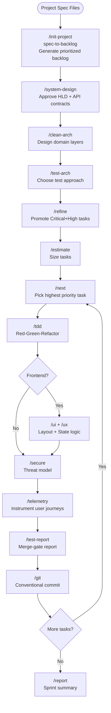
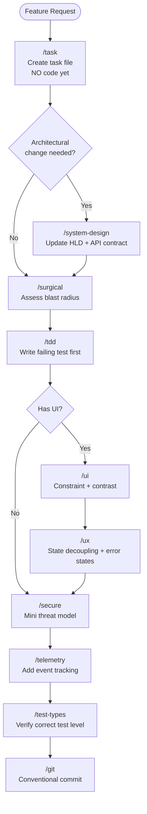
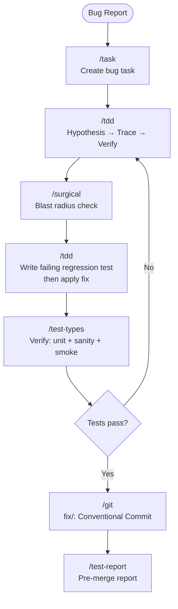
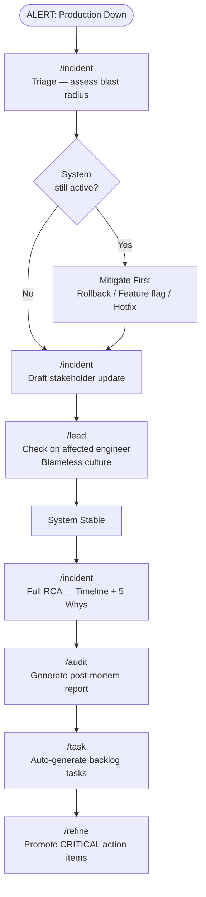
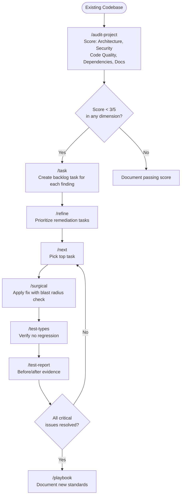

# AI Team Toolkit

> **🚨 EXPERIMENTAL WARNING:** This project is currently an experimental concept and a work-in-progress (trial and error). **Do NOT use this in a production environment**, as it may cause unexpected errors, delete files, or lead to unintended consequences.

> An AI-powered development team toolkit using Claude — skills, agents, and workflows that assemble a disciplined engineering squad for any software project.

A collection of **26 skills**, **2 domain specialists**, and an **8-agent engineering squad** that transforms Claude Code into a structured, team-based engineering system.

Skills enforce domain standards in-context via slash commands. Domain specialists provide industry knowledge. Engineering agents execute work autonomously and can be orchestrated as a full squad.

---

## Mental Model: Skills vs Agents

| | Skills | Agents |
|---|---|---|
| **What it is** | A domain standard loaded into the current context | A standalone AI instance with its own context window |
| **How to invoke** | Slash command: `/clean-arch`, `/secure`, `/tdd` | `claude --agent <name>` or `@"name (agent)"` |
| **Runs in** | Your current conversation | Its own isolated context — starts fresh every time |
| **Memory** | Shares your conversation history | No conversation history unless you pass it explicitly |
| **Tools** | Same as your session | Only the tools declared in the agent's definition |
| **Purpose** | Enforce a specific standard or workflow during a task | Execute a category of work autonomously |
| **Best for** | "While I'm coding, apply this architecture standard" | "Go implement this feature and come back with the result" |

**In practice, agents USE skills.** When a squad agent starts a task, it reads the skills index and loads the relevant skill (e.g., `clean-architecture`, `anti-regression`) before writing code.

---

## The Three-Tier System

This toolkit is designed around three tiers that work in sequence:

```
┌─────────────────────────────────────────────────────────┐
│  TIER 1 — Domain Specialists                            │
│  WHAT to build · domain rules · regulations · data      │
│  fintech-specialist · insurance-specialist              │
└──────────────────────────┬──────────────────────────────┘
                           │ Domain Brief
                           ▼
┌─────────────────────────────────────────────────────────┐
│  TIER 2 — Principal Engineer                            │
│  HOW to structure the team · technical direction        │
│  platform strategy · ADRs · squad assembly              │
└──────────────────────────┬──────────────────────────────┘
                           │ Delegation
                           ▼
┌─────────────────────────────────────────────────────────┐
│  TIER 3 — Engineering Squad                             │
│  EXECUTION · code · infra · tests · security · mobile   │
│  fullstack · devops · qa · security · ios · android     │
└─────────────────────────────────────────────────────────┘
```

**Tier 1** is optional — skip it for general engineering work. It is required when building in a regulated or domain-heavy space (finance, insurance, health).

**Tier 2** is always the orchestrator. It reads domain context, makes platform decisions, assembles the squad, and synthesizes results back to you.

**Tier 3** are the executors. Each specialist loads the relevant skills before starting work.

---

## Tier 1 — Domain Specialists

Domain specialists carry deep industry knowledge: regulations, protocols, data models, and compliance patterns. They advise on **what to build** and what constraints apply. They do not write code.

| Agent | Model | Invoke when... |
|---|---|---|
| `fintech-specialist` | Sonnet 4.6 | Building payments, banking, wallets, lending, KYC/AML, or anything touching PCI-DSS, PSD2, SWIFT, ACH, ISO 20022 |
| `insurance-specialist` | Sonnet 4.6 | Building policy admin, claims, underwriting, or anything touching NAIC, HIPAA, ACA, Solvency II, IFRS 17 |

```bash
# Start a domain consultation
claude --agent fintech-specialist
claude --agent insurance-specialist

# Or invoke mid-conversation
@"fintech-specialist (agent)" review this payment API design
```

---

## Tier 2 — Principal Engineer

The orchestrator. A hybrid Technical Director and Product Manager: it defines **what to build and why**, assembles the right squad, sets technical direction, and surfaces risks. It does not write code.

```bash
claude --agent principal-engineer
```

The principal engineer:
1. Reads your project context files (`PROJECT_BRIEF.md`, `REQUIREMENTS.md`, `DESIGN.md`)
2. Reads the domain brief from Tier 1 (if applicable)
3. Makes the platform decision (web, native mobile, cross-platform)
4. Assembles the squad and delegates with scoped, context-rich prompts
5. Tells each specialist which skills to load
6. Synthesizes results back to you

---

## Tier 3 — Engineering Squad

Eight specialists that execute focused work. The principal engineer routes to them; you can also invoke them directly for single-discipline tasks.

```
principal-engineer
  ├── fullstack-engineer      ← any language, any framework, frontend + backend
  ├── devops-engineer         ← CI/CD, infra, containers, networking, observability
  ├── qa-engineer             ← test strategy, test writing, quality gates
  ├── security-engineer       ← threat modeling, security review, vulnerability fixes
  ├── native-ios              ← Swift, SwiftUI, UIKit, App Store
  ├── native-android          ← Kotlin, Jetpack Compose, Play Store
  └── cross-platform-mobile   ← Flutter (primary), React Native, KMM
```

### Agent Roster

| Agent | Model | Role | Invoke directly when... |
|---|---|---|---|
| `principal-engineer` | Opus 4.8 | Technical Director + PM | You need strategic direction, roadmap, or architecture guidance |
| `fullstack-engineer` | Sonnet 4.6 | All application code (any language/framework) | Focused implementation or code review task |
| `devops-engineer` | Sonnet 4.6 | Infrastructure, CI/CD, containers, observability | Focused infra or pipeline task |
| `qa-engineer` | Sonnet 4.6 | Test strategy, test writing, quality gates | Writing tests or auditing coverage |
| `security-engineer` | Sonnet 4.6 | Threat modeling, security review | Security audit or sensitive change review |
| `native-ios` | Sonnet 4.6 | Swift, SwiftUI, UIKit, App Store delivery | iOS-specific implementation or App Store compliance |
| `native-android` | Sonnet 4.6 | Kotlin, Jetpack Compose, Play Store delivery | Android-specific implementation or Play Store compliance |
| `cross-platform-mobile` | Sonnet 4.6 | Flutter (primary), React Native, KMM | Shared-codebase mobile app, platform trade-off analysis |

---

## Leader's Guidebook

How to start any project using this toolkit — from domain consultation to squad execution.

### Step 1 — Prepare project context files

Before starting any agent session, create these files in your project root. They are how agents understand your project — the more complete they are, the better every agent's output.

```
your-project/
├── PROJECT_BRIEF.md    ← project goals, users, platform, constraints
├── REQUIREMENTS.md     ← functional + non-functional requirements
└── DESIGN.md           ← architecture, tech stack, domain models
```

Copy the templates from this repo:

```bash
cp my-claude-skill/templates/PROJECT_BRIEF.md your-project/
cp my-claude-skill/templates/REQUIREMENTS.md  your-project/
```

Fill them out before running any agent.

---

### Step 2 — Domain consultation (skip for general projects)

If your project is in a regulated or domain-heavy space, start here.

```bash
claude --agent fintech-specialist
# or
claude --agent insurance-specialist
```

Tell the specialist what you are building. It will output:
- Applicable regulations and standards
- Required data models (with correct field types)
- Architecture constraints and patterns
- Compliance checklist

**Save the output as `DOMAIN_BRIEF.md` in your project root.** This becomes input for the principal engineer.

---

### Step 3 — Principal engineer kickoff

```bash
claude --agent principal-engineer
```

Hand it your context files:

> "Read `PROJECT_BRIEF.md`, `REQUIREMENTS.md`, and `DOMAIN_BRIEF.md`. Analyze the project and give me a platform strategy, initial ADR, and squad plan."

The principal engineer will:
1. Confirm the platform decision (web / native mobile / cross-platform)
2. Decide which squad agents are needed
3. Run `/init-project` to generate a prioritized backlog from your spec
4. Produce an Architecture Decision Record
5. Brief each specialist on what to build and which skills to load

---

### Step 4 — Squad execution

Squad agents work from tasks on the kanban board (`backlog/` → `todo/` → `in-progress/` → `done/`).

```bash
# Pick the next task and start work
claude --agent fullstack-engineer
# "Read PROJECT_BRIEF.md and pick up the next task in todo/"

# Run parallel tracks
claude --agent qa-engineer       # write tests
claude --agent security-engineer # threat model
```

The domain specialist remains available for consultation throughout execution:

```
@"fintech-specialist (agent)" is this ledger model correct for PSD2 compliance?
```

---

### Example: Fintech Mobile Wallet App

```
User: "Build a mobile fintech wallet app"
         │
         ▼
┌─────────────────────────────────────────────────────────────┐
│ STEP 1 — fintech-specialist                                 │
│ → KYC/AML tiers, PCI-DSS scope reduction via tokenization  │
│ → Idempotency key requirement on all payment mutations      │
│ → Double-entry ledger, amounts as integer minor units       │
│ → OFAC screening before every transaction                   │
│ → Output: DOMAIN_BRIEF.md                                   │
└──────────────────────────┬──────────────────────────────────┘
                           │
                           ▼
┌─────────────────────────────────────────────────────────────┐
│ STEP 2 — principal-engineer reads domain + project brief    │
│ → Platform decision: cross-platform (Flutter) — iOS + Android│
│ → Squad: fullstack + cross-platform-mobile + security + qa  │
│          + devops                                           │
│ → ADR: Flutter BLoC + Clean Architecture, PCI-DSS scope     │
│        reduction to SAQ-A via Stripe Elements               │
│ → Backlog generated from spec (/init-project)               │
└──────────────────────────┬──────────────────────────────────┘
                           │
                           ▼
┌─────────────────────────────────────────────────────────────┐
│ STEP 3 — Squad execution                                    │
│                                                             │
│  cross-platform-mobile                                      │
│    → Flutter app, BLoC state management, feature modules   │
│    → Loads: clean-architecture, universal-ux, core-engineering│
│                                                             │
│  fullstack-engineer                                         │
│    → Backend API: ledger, payment rails, idempotency        │
│    → Loads: clean-architecture, secure-by-design            │
│                                                             │
│  security-engineer                                          │
│    → PCI-DSS scope, tokenization, OFAC check integration   │
│    → Loads: secure-by-design                               │
│                                                             │
│  qa-engineer                                                │
│    → Payment flow tests, idempotency regression tests       │
│    → Loads: test-strategy, test-architecture                │
│                                                             │
│  devops-engineer                                            │
│    → Secrets management, CI/CD, environment isolation       │
│    → Loads: cloud-native, secure-by-design                  │
│                                                             │
│  fintech-specialist (on-call for domain questions)          │
└─────────────────────────────────────────────────────────────┘
```

---

## Project Context Templates

Two templates live in `templates/`. Copy them into any project before starting an agent session.

### `templates/PROJECT_BRIEF.md`
Captures the project goal, target users, platforms, and business constraints. The principal engineer reads this to make the platform decision and assemble the squad.

### `templates/REQUIREMENTS.md`
Captures functional and non-functional requirements in a structured format agents can parse. Feeds `/init-project` to generate the backlog.

---

## Skill Catalog

Skills enforce domain standards. Load them via slash command during any task.

### Architecture & Design

| Skill | Command | Purpose |
|---|---|---|
| `system-design-rules` | `/system-design` | API-first design, Mermaid diagrams, trade-off analysis, CAP theorem |
| `clean-architecture` | `/clean-arch` | DDD, Dependency Rule, DTO boundaries, rich domain models |

### Frontend

| Skill | Command | Purpose |
|---|---|---|
| `universal-ui` | `/ui` | Visual hierarchy, contrast rules, touch targets, responsive layout |
| `universal-ux` | `/ux` | State-View decoupling, idempotency, form resilience, UX lifecycle |

### Infrastructure & DevOps

| Skill | Command | Purpose |
|---|---|---|
| `cloud-native` | `/infra` | Stateless containers, IaC idempotency, TLS, graceful degradation |

### Security

| Skill | Command | Purpose |
|---|---|---|
| `secure-by-design` | `/secure` | Zero Trust, PoLP, IDOR prevention, rate limiting, secret management |

### Testing

| Skill | Command | Purpose |
|---|---|---|
| `test-strategy` | `/test-types` | 4 core levels, functional types, non-functional types, Test Pyramid |
| `test-architecture` | `/test-arch` | BDD/ATDD/Contract/Mutation/Property-Based + CI/CD gates |
| `test-report-generator` | `/test-report` | Run suite, triage failures, write dated merge-gate report |

### Product & Analytics

| Skill | Command | Purpose |
|---|---|---|
| `product-midset` | `/product` | Product mindset, FinOps, ROI-driven decisions |
| `business-telemetry` | `/telemetry` | Event schema design, funnel tracking, PII-safe analytics |

### Project Management (Kanban)

| Skill | Command | Purpose |
|---|---|---|
| `spec-to-backlog` | `/init-project` | Day 0: spec → prioritized backlog |
| `agentic-kanban` | `/task` | Create task files before writing any code |
| `backlog-refinement` | `/refine` | Promote tasks by priority level, Critical-first rule |
| `next-task` | `/next` | WIP limit = 1, priority-pick, plan before coding |
| `task-estimation` | `/estimate` | T-shirt sizing, AI turns estimate, human review effort |
| `local-progress-reporter` | `/report` | Board status report with progress bar and blockers |
| `audit-to-backlog` | `/audit` | Post-mortem / code audit → report + backlog tasks |
| `project-audit-reviewer` | `/audit-project` | Full codebase health check, scored by dimension |

### Workflow & Engineering Discipline

| Skill | Command | Purpose |
|---|---|---|
| `core-engineering` | `/tdd` | TDD Red-Green-Refactor cycle, debugging mantra |
| `anti-regression` | `/surgical` | Blast radius assessment, surgical edits, no silent deletions |
| `ai-output` | `/discipline` | Token efficiency, atomic code blocks, execution safety |
| `project-hygiene` | `/git` | Conventional commits, squash merge, ADR, branch strategy |

### Leadership & Culture

| Skill | Command | Purpose |
|---|---|---|
| `incident-response` | `/incident` | Triage, rollback, stakeholder comms, blameless RCA |
| `servant-leadership` | `/lead` | Code reviews, mentorship, psychological safety |

### Documentation

| Skill | Command | Purpose |
|---|---|---|
| `standard-playbook-generator` | `/playbook` | Generate anonymized engineering playbooks and workflow guides |

---

## Workflows

### Squad Workflow — Greenfield Feature


---

### Skill Workflow 1 — Greenfield Project Kickoff



---

### Skill Workflow 2 — Feature Development Cycle



---

### Skill Workflow 3 — Bug Fix



---

### Skill Workflow 4 — Production Incident Response



---

### Skill Workflow 5 — Code Quality Audit



---

## Quick Reference

### Agents

| Start session as | Command |
|---|---|
| Orchestrator (full squad) | `claude --agent principal-engineer` |
| Fintech domain expert | `claude --agent fintech-specialist` |
| Insurance domain expert | `claude --agent insurance-specialist` |
| Full-stack developer | `claude --agent fullstack-engineer` |
| DevOps engineer | `claude --agent devops-engineer` |
| QA engineer | `claude --agent qa-engineer` |
| Security engineer | `claude --agent security-engineer` |
| iOS engineer | `claude --agent native-ios` |
| Android engineer | `claude --agent native-android` |
| Cross-platform mobile | `claude --agent cross-platform-mobile` |

### Skills

| Command | Skill | When to use |
|---|---|---|
| `/system-design` | system-design-rules | Before writing any new system or API |
| `/clean-arch` | clean-architecture | Designing or reviewing layer structure |
| `/ui` | universal-ui | Any frontend layout / visual work |
| `/ux` | universal-ux | Any frontend state / flow / error handling |
| `/infra` | cloud-native | Docker, K8s, CI/CD, IaC |
| `/secure` | secure-by-design | Any auth, data handling, or new endpoint |
| `/test-types` | test-strategy | Choosing the right test for the situation |
| `/test-arch` | test-architecture | Designing a test suite or CI/CD pipeline |
| `/test-report` | test-report-generator | Pre-merge quality gate |
| `/tdd` | core-engineering | Writing new code or fixing a bug |
| `/surgical` | anti-regression | Modifying existing files |
| `/discipline` | ai-output | Enforcing output formatting standards |
| `/git` | project-hygiene | Commits, branches, README, ADR |
| `/init-project` | spec-to-backlog | Day 0 — spec → backlog |
| `/task` | agentic-kanban | New bug or feature — create task first |
| `/refine` | backlog-refinement | Sprint planning — promote tasks by priority |
| `/estimate` | task-estimation | Size tasks before sprint |
| `/next` | next-task | Start next highest-priority task |
| `/report` | local-progress-reporter | Sprint / project status snapshot |
| `/audit` | audit-to-backlog | Post-mortem or code audit |
| `/audit-project` | project-audit-reviewer | Full codebase health check |
| `/incident` | incident-response | Active production outage |
| `/lead` | servant-leadership | Code review, mentorship, team comms |
| `/product` | product-midset | Feature ROI, FinOps, build-vs-buy |
| `/telemetry` | business-telemetry | Adding event tracking |
| `/playbook` | standard-playbook-generator | Generate engineering documentation |

---

## ⚠️ Real-World Considerations & Known Limitations

While this toolkit provides a highly structured agentic workflow, there are practical trade-offs to consider before adopting it for daily production use:

1. **Token Cost & Latency:** Orchestrating multiple agents, passing large context files (`PROJECT_BRIEF.md`, `DOMAIN_BRIEF.md`), and dynamically loading skills consumes a significant amount of tokens. Each turn can be expensive and may take several minutes to execute due to the context size.
2. **File-Based Kanban Fragility:** The current kanban system (`todo/`, `in-progress/`, `done/`) relies on the AI reading and moving `.md` files via bash commands. In long conversations, the AI might occasionally lose track of state, overwrite files incorrectly, or hallucinate the board's status.
3. **Process Heavy for Small Tasks:** The strict three-tier architecture and engineering discipline are designed for complex features. Using the full squad workflow for a minor CSS tweak or simple hotfix is overkill and will create unnecessary bottlenecks.
4. **Agent Orchestration Loops:** Autonomous agent interactions (e.g., `qa-engineer` rejects code -> `fullstack-engineer` fixes -> `qa-engineer` rejects again) can potentially get stuck in a retry cycle, burning tokens. It is highly recommended to monitor execution and enforce a "Human-in-the-loop" intervention if tests fail repeatedly.

*Note: Future updates may explore Function Calling / Tools for more robust Kanban state management and "Fast-Track" modes for smaller engineering tasks.*

---

## Setup

```bash
# Clone the repo
git clone <repo-url>
cd ai-team-toolkit

# Deploy skills to ~/.claude/skills/
bash scripts/sync_skills.sh

# Deploy agents to ~/.claude/agents/
bash scripts/sync_agents.sh
```

Re-run after any skill or agent update.

---

## Repository Structure

```
ai-team-toolkit/
├── agents/
│   ├── principal-engineer.md      # Orchestrator — routes to specialists
│   ├── fintech-specialist.md      # Fintech domain expert (payments, KYC, PCI-DSS)
│   ├── insurance-specialist.md    # Insurance domain expert (NAIC, HIPAA, claims)
│   ├── fullstack-engineer.md      # Full-stack developer (any language/framework)
│   ├── devops-engineer.md         # CI/CD, infra, containers, networking
│   ├── qa-engineer.md             # Test strategy and test writing
│   ├── security-engineer.md       # Threat modeling and security review
│   ├── native-ios.md              # iOS specialist (Swift, SwiftUI, App Store)
│   ├── native-android.md          # Android specialist (Kotlin, Compose, Play Store)
│   └── cross-platform-mobile.md   # Flutter/RN/KMM cross-platform specialist
├── templates/
│   ├── PROJECT_BRIEF.md           # Project goal, users, platform, constraints
│   └── REQUIREMENTS.md            # Functional + non-functional requirements
├── scripts/
│   ├── sync_skills.sh             # Deploy skills to ~/.claude/skills/
│   └── sync_agents.sh             # Deploy agents to ~/.claude/agents/
├── skills/
│   ├── architecture/
│   │   └── system-design-rules/
│   ├── backend/
│   │   └── clean-architecture/
│   ├── documents/
│   │   └── standard-playbook-generator/
│   ├── frontend/
│   │   ├── universal-ui/
│   │   └── universal-ux/
│   ├── infrastructure/
│   │   └── cloud-native/
│   ├── kanban/
│   │   ├── agentic-kanban/
│   │   ├── audit-to-backlog/
│   │   ├── backlog-refinement/
│   │   ├── local-progress-reporter/
│   │   ├── next-task/
│   │   ├── spec-to-backlog/
│   │   └── task-estimation/
│   ├── leadership/
│   │   ├── incident-response/
│   │   └── servant-leadership/
│   ├── product/
│   │   ├── business-telemetry/
│   │   └── product-midset/
│   ├── security/
│   │   └── secure-by-design/
│   ├── testing/
│   │   ├── test-architecture/
│   │   └── test-strategy/
│   └── workflow/
│       ├── ai-output/
│       ├── anti-regression/
│       ├── core-engineering/
│       ├── project-audit-reviewer/
│       ├── project-hygiene/
│       └── test-report-generator/
├── CLAUDE.md                      # Master instructions for this repo
└── README.md                      # This file
```
