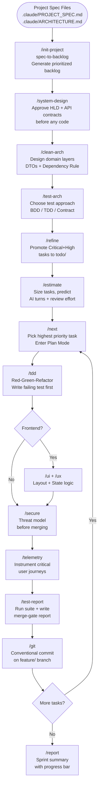
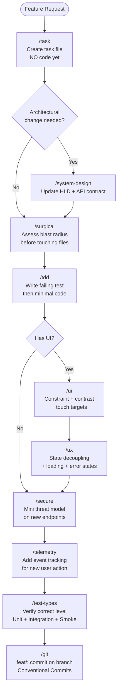
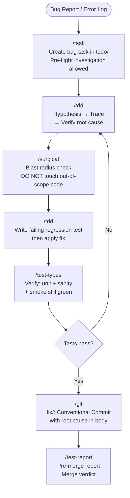
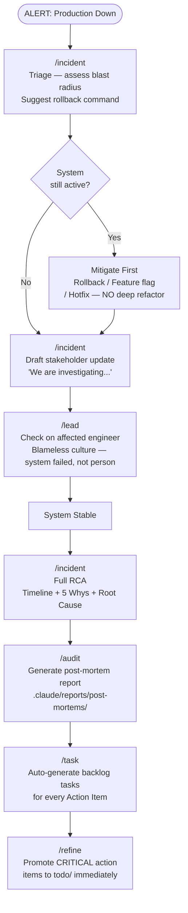
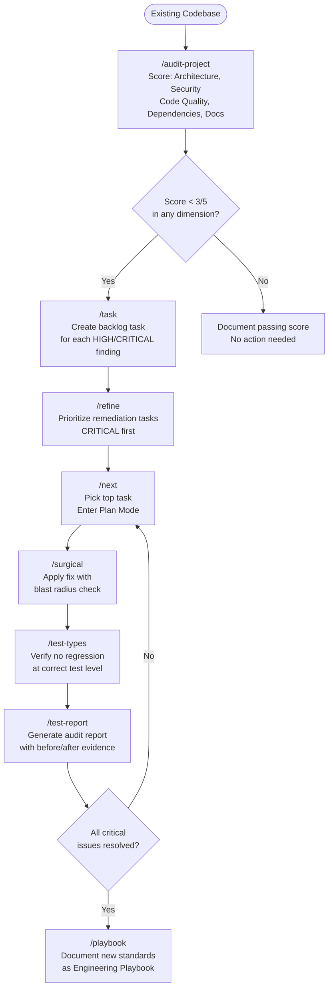
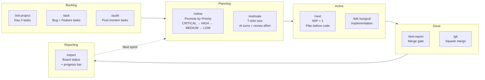

# My Claude Skills — Engineering Standards

A collection of 26 structured AI skills that transform Claude Code into a disciplined senior engineering system. Each skill enforces a specific engineering standard through XML-based system prompts, `<thinking>` blocks, and fatal constraints.

---

## Philosophy

- **Separation of Concerns** — Skills are modular. Claude loads only what the task requires, preserving context window.
- **Thinking Before Doing** — Every skill forces a `<thinking>` block to evaluate trade-offs before generating a single line of code.
- **Fatal Constraints** — Hard rules that cannot be broken regardless of user instruction (e.g., no coding before architecture approval, no mocks in integration tests).
- **Versioned** — Every skill carries a semantic version so you can track evolution.

---

## Skill Catalog

### Architecture & Design

| Skill | Command | Version | Purpose |
|---|---|---|---|
| `system-design-rules` | `/system-design` | v1.1.0 | API-first design, Mermaid diagrams, trade-off analysis, CAP theorem |
| `clean-architecture` | `/clean-arch` | v1.1.0 | DDD, Dependency Rule, DTO boundaries, rich domain models |

### Frontend

| Skill | Command | Version | Purpose |
|---|---|---|---|
| `universal-ui` | `/ui` | v1.1.0 | Visual hierarchy, contrast rules, touch targets, responsive layout |
| `universal-ux` | `/ux` | v1.1.0 | State-View decoupling, idempotency, form resilience, UX lifecycle |

### Infrastructure & DevOps

| Skill | Command | Version | Purpose |
|---|---|---|---|
| `cloud-native` | `/infra` | v1.1.0 | Stateless containers, IaC idempotency, TLS, graceful degradation |

### Security

| Skill | Command | Version | Purpose |
|---|---|---|---|
| `secure-by-design` | `/secure` | v1.1.0 | Zero Trust, PoLP, IDOR prevention, rate limiting, secret management |

### Testing

| Skill | Command | Version | Purpose |
|---|---|---|---|
| `test-strategy` | `/test-types` | v1.0.0 | 4 core levels, functional types, non-functional types, Test Pyramid |
| `test-architecture` | `/test-arch` | v1.1.0 | BDD/ATDD/Contract/Mutation/Property-Based + CI/CD gates |
| `test-report-generator` | `/test-report` | v1.1.0 | Run suite, triage failures, write dated merge-gate report |

### Product & Analytics

| Skill | Command | Version | Purpose |
|---|---|---|---|
| `product-midset` | `/product` | v1.1.0 | Product mindset, FinOps, ROI-driven decisions |
| `business-telemetry` | `/telemetry` | v1.1.0 | Event schema design, funnel tracking, PII-safe analytics |

### Project Management (Kanban)

| Skill | Command | Version | Purpose |
|---|---|---|---|
| `spec-to-backlog` | `/init-project` | v1.1.0 | Day 0: spec → prioritized backlog |
| `agentic-kanban` | `/task` | v1.1.0 | Create task files before writing any code |
| `backlog-refinement` | `/refine` | v1.1.0 | Promote tasks by priority level, Critical-first rule |
| `next-task` | `/next` | v1.1.0 | WIP limit = 1, priority-pick, plan before coding |
| `task-estimation` | `/estimate` | v1.1.0 | T-shirt sizing, AI turns estimate, human review effort |
| `local-progress-reporter` | `/report` | v1.1.0 | Board status report with progress bar and blockers |
| `audit-to-backlog` | `/audit` | v1.1.0 | Post-mortem / code audit → report + backlog tasks |
| `project-audit-reviewer` | `/audit-project` | v1.1.0 | Full codebase health check, scored by dimension |

### Workflow & Engineering Discipline

| Skill | Command | Version | Purpose |
|---|---|---|---|
| `core-engineering` | `/tdd` | v1.1.0 | TDD Red-Green-Refactor cycle, debugging mantra |
| `anti-regression` | `/surgical` | v1.1.0 | Blast radius assessment, surgical edits, no silent deletions |
| `ai-output` | `/discipline` | v1.1.0 | Token efficiency, atomic code blocks, execution safety |
| `project-hygiene` | `/git` | v1.1.0 | Conventional commits, squash merge, ADR, branch strategy |

### Leadership & Culture

| Skill | Command | Version | Purpose |
|---|---|---|---|
| `incident-response` | `/incident` | v1.1.0 | Triage, rollback, stakeholder comms, blameless RCA |
| `servant-leadership` | `/lead` | v1.1.0 | Code reviews, mentorship, psychological safety |

### Documentation

| Skill | Command | Version | Purpose |
|---|---|---|---|
| `standard-playbook-generator` | `/playbook` | v1.1.0 | Generate anonymized engineering playbooks and workflow guides |

---

## Project Workflows

The following diagrams show how skills chain together for the most common project scenarios. Each node shows the command to invoke.

---

### Workflow 1 — Greenfield Project Kickoff

> From raw specification to first running sprint.



---

### Workflow 2 — Feature Development Cycle

> Day-to-day development loop for a single feature task.



---

### Workflow 3 — Bug Fix

> From bug report to verified fix, without breaking existing features.



---

### Workflow 4 — Production Incident Response

> Active outage to blameless post-mortem to backlog.



---

### Workflow 5 — Code Quality Audit

> Assess and remediate an existing codebase.



---

### Workflow 6 — Sprint Planning & Progress

> Kanban board management from backlog to done.



---

## Quick Command Reference

| Command | Skill | When to use |
|---|---|---|
| `/system-design` | system-design-rules | Before writing any new system or API |
| `/clean-arch` | clean-architecture | Designing or reviewing layer structure |
| `/ui` | universal-ui | Any frontend layout / visual work |
| `/ux` | universal-ux | Any frontend state / flow / error handling |
| `/infra` | cloud-native | Docker, K8s, CI/CD, IaC |
| `/secure` | secure-by-design | Any auth, data handling, or new endpoint |
| `/test-types` | test-strategy | Choosing the right test for the situation |
| `/test-arch` | test-architecture | Designing a test suite or CI/CD pipeline |
| `/test-report` | test-report-generator | Pre-merge quality gate |
| `/tdd` | core-engineering | Writing new code or fixing a bug |
| `/surgical` | anti-regression | Modifying existing files |
| `/discipline` | ai-output | Enforcing output formatting standards |
| `/git` | project-hygiene | Commits, branches, README, ADR |
| `/init-project` | spec-to-backlog | Day 0 — spec → backlog |
| `/task` | agentic-kanban | New bug or feature — create task first |
| `/refine` | backlog-refinement | Sprint planning — promote tasks by priority |
| `/estimate` | task-estimation | Size tasks before sprint |
| `/next` | next-task | Start next highest-priority task |
| `/report` | local-progress-reporter | Sprint / project status snapshot |
| `/audit` | audit-to-backlog | Post-mortem or code audit |
| `/audit-project` | project-audit-reviewer | Full codebase health check |
| `/incident` | incident-response | Active production outage |
| `/lead` | servant-leadership | Code review, mentorship, team comms |
| `/product` | product-midset | Feature ROI, FinOps, build-vs-buy |
| `/telemetry` | business-telemetry | Adding event tracking |
| `/playbook` | standard-playbook-generator | Generate engineering documentation |

---

## Setup

```bash
# Clone and sync all skills to Claude Code globally
git clone <repo-url>
cd my-claude-skill
bash scripts/sync_skills.sh
```

The sync script flattens the category structure, copies each `SKILL.md` to `~/.claude/skills/<skill-name>/`, and regenerates `~/.claude/skills/INDEX.md` with the full command reference.

To re-sync after any skill update:

```bash
bash scripts/sync_skills.sh
```

---

## Repository Structure

```
my-claude-skill/
├── scripts/
│   └── sync_skills.sh          # Deploy skills to ~/.claude/skills/
├── skills/
│   ├── architecture/
│   │   └── system-design-rules/
│   ├── backend/
│   │   └── clean-architecture/
│   ├── documents/
│   │   └── standard-playbook-generator/
│   ├── frontend/
│   │   ├── universal-ui/
│   │   └── universal-ux/
│   ├── infrastructure/
│   │   └── cloud-native/
│   ├── kanban/
│   │   ├── agentic-kanban/
│   │   ├── audit-to-backlog/
│   │   ├── backlog-refinement/
│   │   ├── local-progress-reporter/
│   │   ├── next-task/
│   │   ├── spec-to-backlog/
│   │   └── task-estimation/
│   ├── leadership/
│   │   ├── incident-response/
│   │   └── servant-leadership/
│   ├── product/
│   │   ├── business-telemetry/
│   │   └── product-midset/
│   ├── security/
│   │   └── secure-by-design/
│   ├── testing/
│   │   ├── test-architecture/
│   │   └── test-strategy/
│   └── workflow/
│       ├── ai-output/
│       ├── anti-regression/
│       ├── core-engineering/
│       ├── project-audit-reviewer/
│       ├── project-hygiene/
│       └── test-report-generator/
├── CLAUDE.md                   # Master instructions for this repo
└── README.md                   # This file
```
