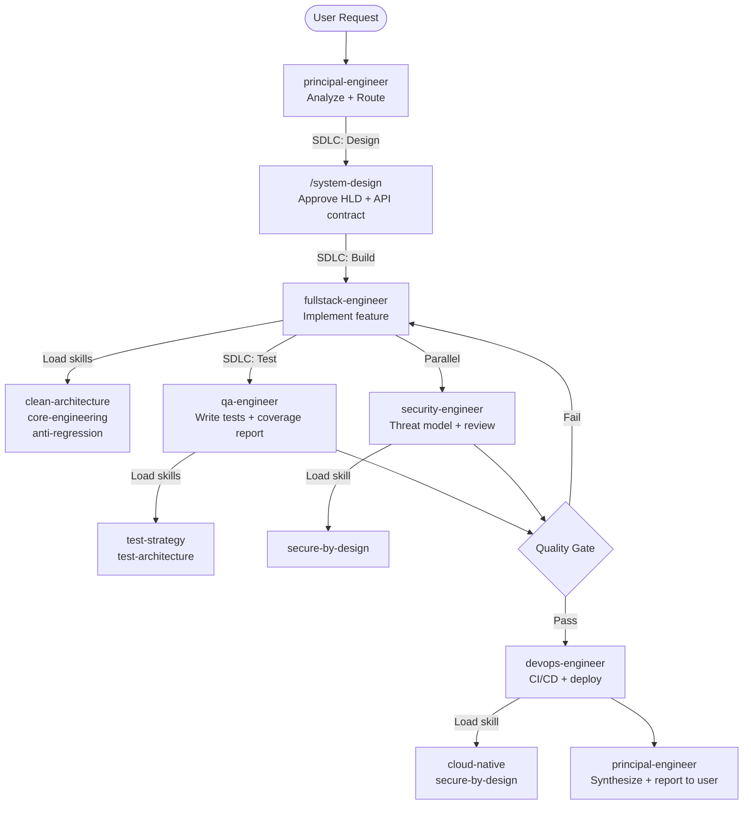
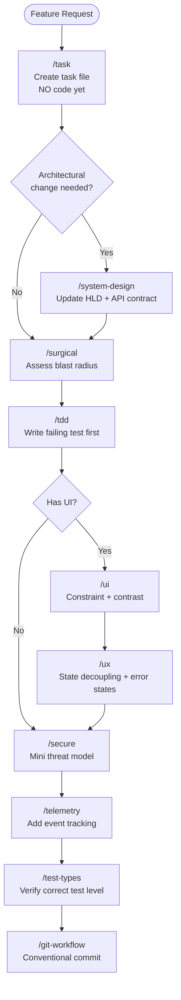
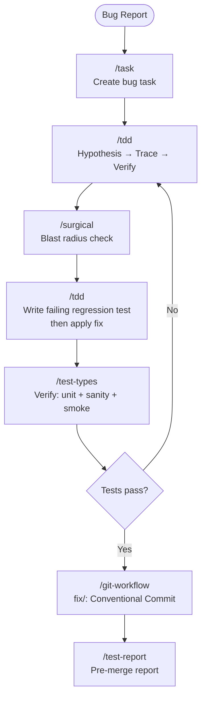

# AI Team Toolkit

> **EXPERIMENTAL WARNING:** This project is a work-in-progress. **Do NOT use in a production environment** — it may cause unexpected errors, delete files, or produce unintended consequences.

An AI-powered development team toolkit using Claude — skills, agents, and workflows that assemble a disciplined engineering squad for any software project.

A collection of **30 skills**, **2 domain specialists**, and an **8-agent engineering squad** that transforms Claude Code into a structured, team-based engineering system. Board state is managed through a typed MCP server — agents call board tools natively instead of composing shell commands.

---

## Table of Contents

- [Quick Start](#quick-start)
- [Installation](#installation)
  - [Prerequisites](#prerequisites)
  - [macOS / Linux](#macos--linux)
  - [Windows](#windows)
- [How It Works](#how-it-works)
  - [Skills vs Agents](#skills-vs-agents)
  - [The Three-Tier System](#the-three-tier-system)
- [Tier 1 — Domain Specialists](#tier-1--domain-specialists)
- [Tier 2 — Principal Engineer](#tier-2--principal-engineer)
- [Tier 3 — Engineering Squad](#tier-3--engineering-squad)
- [Skill Catalog](#skill-catalog)
- [Leader's Guidebook](#leaders-guidebook)
- [Workflows](#workflows)
- [Repository Structure](#repository-structure)
- [Known Limitations](#known-limitations)

---

## Quick Start

**1. Clone and install**

```bash
# macOS / Linux
git clone <repo-url> ai-team-toolkit
cd ai-team-toolkit
bash scripts/install/sync_skills.sh
bash scripts/install/sync_agents.sh
```

```powershell
# Windows (PowerShell — run as Administrator if needed)
git clone <repo-url> ai-team-toolkit
cd ai-team-toolkit
.\scripts\install\sync_skills.ps1
.\scripts\install\sync_agents.ps1
```

**2. Set up your project context**

```bash
cp templates/PROJECT_BRIEF.md  your-project/
cp templates/REQUIREMENTS.md   your-project/
# Fill in both files — agents read them before every session
```

**3. Start the orchestrator**

```bash
claude --agent principal-engineer
```

> "Read `PROJECT_BRIEF.md` and `REQUIREMENTS.md`. Give me a platform strategy, initial ADR, and squad plan."

**4. Generate your backlog**

```
/init-project
```

**5. Pick the first task and build**

```
/next
```

That's it. See [GETTING_STARTED.md](./GETTING_STARTED.md) for a step-by-step walkthrough.

---

## Installation

### Prerequisites

- [Claude Code CLI](https://claude.ai/code) installed and authenticated
- Git
- **[Node.js](https://nodejs.org/) v18 or v24** *(required for the kanban MCP server and CLI fallback scripts)*
- **macOS / Linux:** Bash 3.2+, `rsync`
- **Windows:** PowerShell 5.1+ or [PowerShell Core 7+](https://github.com/PowerShell/PowerShell/releases)

### macOS / Linux

```bash
# Clone the repo
git clone <repo-url> ai-team-toolkit
cd ai-team-toolkit

# Install skills to ~/.claude/skills/
bash scripts/install/sync_skills.sh

# Install agents to ~/.claude/agents/
bash scripts/install/sync_agents.sh
```

Re-run both scripts after any skill or agent update.

### Windows

Open PowerShell (5.1+ or Core 7+) and run:

```powershell
# Clone the repo
git clone <repo-url> ai-team-toolkit
cd ai-team-toolkit

# If script execution is blocked, enable it first (one-time, current user):
Set-ExecutionPolicy -ExecutionPolicy RemoteSigned -Scope CurrentUser

# Install skills to %USERPROFILE%\.claude\skills\
.\scripts\install\sync_skills.ps1

# Install agents to %USERPROFILE%\.claude\agents\
.\scripts\install\sync_agents.ps1
```

Re-run both scripts after any skill or agent update.

> **Kanban board scripts and MCP server** (`scripts/kanban/`, `scripts/mcp/`) are separate — they implement board I/O for your target project and are not part of the install process. Both require **Node.js v18+** to run. See `scripts/mcp/README.md` for MCP server setup.

---

## How It Works

### Skills vs Agents

| | Skills | Agents |
|---|---|---|
| **What it is** | A domain standard loaded into the current context | A standalone AI instance with its own context window |
| **How to invoke** | Slash command: `/clean-arch`, `/secure`, `/tdd` | `claude --agent <name>` or `@"name (agent)"` |
| **Runs in** | Your current conversation | Its own isolated context — starts fresh every time |
| **Memory** | Shares your conversation history | No conversation history unless passed explicitly |
| **Tools** | Same as your session | Only the tools declared in the agent definition |
| **Purpose** | Enforce a specific standard or workflow during a task | Execute a category of work autonomously |
| **Best for** | "While I'm coding, apply this architecture standard" | "Go implement this feature and come back with the result" |

**In practice, agents USE skills.** When a squad agent starts a task, it reads the skills index and loads the relevant skill (e.g., `clean-architecture`, `anti-regression`) before writing code.

### The Three-Tier System

```
┌─────────────────────────────────────────────────────────┐
│  TIER 1 — Domain Specialists                            │
│  WHAT to build · domain rules · regulations · data      │
│  fintech-specialist · insurance-specialist              │
└──────────────────────────┬──────────────────────────────┘
                           │ Domain Brief
                           ▼
┌─────────────────────────────────────────────────────────┐
│  TIER 2 — Principal Engineer                            │
│  HOW to structure the team · technical direction        │
│  platform strategy · ADRs · squad assembly              │
└──────────────────────────┬──────────────────────────────┘
                           │ Delegation
                           ▼
┌─────────────────────────────────────────────────────────┐
│  TIER 3 — Engineering Squad                             │
│  EXECUTION · code · infra · tests · security · mobile   │
│  fullstack · devops · qa · security · ios · android     │
└─────────────────────────────────────────────────────────┘
```

**Tier 1** is optional — skip it for general engineering work. Required when building in a regulated or domain-heavy space (finance, insurance, health).

**Tier 2** is always the orchestrator. It reads domain context, makes platform decisions, assembles the squad, and synthesizes results back to you.

**Tier 3** are the executors. Each specialist loads the relevant skills before starting work.

---

## Tier 1 — Domain Specialists

Domain specialists carry deep industry knowledge: regulations, protocols, data models, and compliance patterns. They advise on **what to build** and what constraints apply. They do not write code.

| Agent | Model | Invoke when... |
|---|---|---|
| `fintech-specialist` | Sonnet 4.6 | Building payments, banking, wallets, lending, KYC/AML, or anything touching PCI-DSS, PSD2, SWIFT, ACH, ISO 20022 |
| `insurance-specialist` | Sonnet 4.6 | Building policy admin, claims, underwriting, or anything touching NAIC, HIPAA, ACA, Solvency II, IFRS 17 |

```bash
claude --agent fintech-specialist
claude --agent insurance-specialist

# Or invoke mid-conversation
@"fintech-specialist (agent)" review this payment API design
```

---

## Tier 2 — Principal Engineer

The orchestrator. A hybrid Technical Director and Product Manager: it defines **what to build and why**, assembles the right squad, sets technical direction, and surfaces risks. It does not write code.

```bash
claude --agent principal-engineer
```

The principal engineer:
1. Reads your project context files (`PROJECT_BRIEF.md`, `REQUIREMENTS.md`)
2. Reads the domain brief from Tier 1 (if applicable)
3. Makes the platform decision (web, native mobile, cross-platform)
4. Assembles the squad and delegates with scoped, context-rich prompts
5. Tells each specialist which skills to load
6. Synthesizes results back to you

---

## Tier 3 — Engineering Squad

Eight specialists that execute focused work. The principal engineer routes to them; you can also invoke them directly for single-discipline tasks.

```
principal-engineer
  ├── fullstack-engineer      ← any language, any framework, frontend + backend
  ├── devops-engineer         ← CI/CD, infra, containers, networking, observability
  ├── qa-engineer             ← test strategy, test writing, quality gates
  ├── security-engineer       ← threat modeling, security review, vulnerability fixes
  ├── native-ios              ← Swift, SwiftUI, UIKit, App Store
  ├── native-android          ← Kotlin, Jetpack Compose, Play Store
  └── cross-platform-mobile   ← Flutter (primary), React Native, KMM
```

| Agent | Model | Role | Invoke directly when... |
|---|---|---|---|
| `principal-engineer` | Opus 4.8 | Technical Director + PM | You need strategic direction, roadmap, or architecture guidance |
| `fullstack-engineer` | Sonnet 4.6 | All application code (any language/framework) | Focused implementation or code review task |
| `devops-engineer` | Sonnet 4.6 | Infrastructure, CI/CD, containers, observability | Focused infra or pipeline task |
| `qa-engineer` | Sonnet 4.6 | Test strategy, test writing, quality gates | Writing tests or auditing coverage |
| `security-engineer` | Sonnet 4.6 | Threat modeling, security review | Security audit or sensitive change review |
| `native-ios` | Sonnet 4.6 | Swift, SwiftUI, UIKit, App Store delivery | iOS-specific implementation or App Store compliance |
| `native-android` | Sonnet 4.6 | Kotlin, Jetpack Compose, Play Store delivery | Android-specific implementation or Play Store compliance |
| `cross-platform-mobile` | Sonnet 4.6 | Flutter (primary), React Native, KMM | Shared-codebase mobile app, platform trade-off analysis |

---

## Skill Catalog

Skills enforce domain standards. Load them via slash command during any task.

### Architecture & Design

| Skill | Command | Purpose |
|---|---|---|
| `system-design-rules` | `/system-design` | API-first design, Mermaid diagrams, trade-off analysis, CAP theorem |
| `clean-architecture` | `/clean-arch` | DDD, Dependency Rule, DTO boundaries, rich domain models |

### Frontend

| Skill | Command | Purpose |
|---|---|---|
| `universal-ui` | `/ui` | Visual hierarchy, contrast rules, touch targets, responsive layout |
| `universal-ux` | `/ux` | State-View decoupling, idempotency, form resilience, UX lifecycle |

### Infrastructure & DevOps

| Skill | Command | Purpose |
|---|---|---|
| `cloud-native` | `/infra` | Stateless containers, IaC idempotency, TLS, graceful degradation |

### Security

| Skill | Command | Purpose |
|---|---|---|
| `secure-by-design` | `/secure` | Zero Trust, PoLP, IDOR prevention, rate limiting, secret management |

### Testing

| Skill | Command | Purpose |
|---|---|---|
| `test-strategy` | `/test-types` | 4 core levels, functional types, non-functional types, Test Pyramid |
| `test-architecture` | `/test-arch` | BDD/ATDD/Contract/Mutation/Property-Based + CI/CD gates |
| `test-report-generator` | `/test-report` | Run suite, triage failures, write dated merge-gate report |

### Product & Analytics

| Skill | Command | Purpose |
|---|---|---|
| `product-midset` | `/product` | Product mindset, FinOps, ROI-driven decisions |
| `business-telemetry` | `/telemetry` | Event schema design, funnel tracking, PII-safe analytics |

### Project Management (Kanban)

| Skill | Command | Purpose |
|---|---|---|
| `kanban-io` | `/kanban-io` | Single interface for all board reads and writes — used by other skills |
| `spec-to-backlog` | `/init-project` | Day 0: spec → prioritized backlog |
| `agentic-kanban` | `/task` | Workflow orchestrator — triage, assign, promote tasks |
| `backlog-refinement` | `/refine` | Promote tasks by priority level, Critical-first rule |
| `next-task` | `/next` | WIP limit = 1, priority-pick, plan before coding |
| `task-estimation` | `/estimate` | T-shirt sizing, AI turns estimate, human review effort |
| `local-progress-reporter` | `/report` | Board status report with progress bar and blockers |
| `audit-to-backlog` | `/audit` | Post-mortem / code audit → report + backlog tasks |
| `project-audit-reviewer` | `/audit-project` | Full codebase health check, scored by dimension |

### Workflow & Engineering Discipline

| Skill | Command | Purpose |
|---|---|---|
| `git-workflow` | `/git-workflow` | Branching strategy, commit conventions, PR lifecycle |
| `core-engineering` | `/tdd` | TDD Red-Green-Refactor cycle, debugging mantra |
| `anti-regression` | `/surgical` | Blast radius assessment, surgical edits, no silent deletions |
| `ai-output` | `/discipline` | Token efficiency, atomic code blocks, execution safety |
| `project-hygiene` | `/git` | Conventional commits, squash merge, ADR, branch strategy |

### Leadership & Culture

| Skill | Command | Purpose |
|---|---|---|
| `incident-response` | `/incident` | Triage, rollback, stakeholder comms, blameless RCA |
| `servant-leadership` | `/lead` | Code reviews, mentorship, psychological safety |

### Documentation

| Skill | Command | Purpose |
|---|---|---|
| `standard-playbook-generator` | `/playbook` | Generate anonymized engineering playbooks and workflow guides |

---

## Leader's Guidebook

How to start any project using this toolkit — from domain consultation to squad execution.

### Step 1 — Prepare project context files

Before starting any agent session, create these files in your project root:

```
your-project/
├── PROJECT_BRIEF.md    ← project goals, users, platform, constraints
├── REQUIREMENTS.md     ← functional + non-functional requirements
└── DESIGN.md           ← architecture, tech stack, domain models (optional)
```

Copy the templates from this repo:

```bash
cp ai-team-toolkit/templates/PROJECT_BRIEF.md your-project/
cp ai-team-toolkit/templates/REQUIREMENTS.md  your-project/
```

Fill them out before running any agent.

### Step 2 — Domain consultation (skip for general projects)

If your project is in a regulated or domain-heavy space, start here.

```bash
claude --agent fintech-specialist
# or
claude --agent insurance-specialist
```

Tell the specialist what you are building. It will output:
- Applicable regulations and standards
- Required data models (with correct field types)
- Architecture constraints and patterns
- Compliance checklist

**Save the output as `DOMAIN_BRIEF.md` in your project root.** This becomes input for the principal engineer.

### Step 3 — Principal engineer kickoff

```bash
claude --agent principal-engineer
```

> "Read `PROJECT_BRIEF.md`, `REQUIREMENTS.md`, and `DOMAIN_BRIEF.md`. Analyze the project and give me a platform strategy, initial ADR, and squad plan."

The principal engineer will:
1. Confirm the platform decision (web / native mobile / cross-platform)
2. Decide which squad agents are needed
3. Run `/init-project` to generate a prioritized backlog from your spec
4. Produce an Architecture Decision Record
5. Brief each specialist on what to build and which skills to load

### Step 4 — Squad execution

Squad agents work from tasks on the kanban board (`backlog/` → `todo/` → `in-progress/` → `done/`).

```bash
# Pick the next task and start work
claude --agent fullstack-engineer
# "Read PROJECT_BRIEF.md and pick up the next task in todo/"

# Run parallel tracks
claude --agent qa-engineer       # write tests
claude --agent security-engineer # threat model
```

---

## Workflows

### Squad Workflow — Greenfield Feature



### Skill Workflow 1 — Greenfield Project Kickoff


### Skill Workflow 2 — Feature Development Cycle



### Skill Workflow 3 — Bug Fix



### Skill Workflow 4 — Production Incident Response


### Skill Workflow 5 — Code Quality Audit


---

## Repository Structure

```
ai-team-toolkit/
├── agents/
│   ├── principal-engineer.md      # Orchestrator — routes to specialists
│   ├── fintech-specialist.md      # Fintech domain expert (payments, KYC, PCI-DSS)
│   ├── insurance-specialist.md    # Insurance domain expert (NAIC, HIPAA, claims)
│   ├── fullstack-engineer.md      # Full-stack developer (any language/framework)
│   ├── devops-engineer.md         # CI/CD, infra, containers, networking
│   ├── qa-engineer.md             # Test strategy and test writing
│   ├── security-engineer.md       # Threat modeling and security review
│   ├── native-ios.md              # iOS specialist (Swift, SwiftUI, App Store)
│   ├── native-android.md          # Android specialist (Kotlin, Compose, Play Store)
│   └── cross-platform-mobile.md   # Flutter/RN/KMM cross-platform specialist
├── examples/
│   ├── README.md                  # Walkthrough guide
│   ├── 00-setup/                  # Filled project context templates (TaskFlow)
│   ├── 01-spec-to-backlog/        # Output of /init-project
│   ├── 02-backlog-refinement/     # Output of /refine
│   ├── 03-task-estimation/        # Output of /estimate
│   ├── 04-next-task/              # Output of /next (execution plan)
│   ├── 05-agentic-kanban/         # Output of /task (mid-sprint bug)
│   └── contributing/              # Annotated SKILL.md for skill authors
├── scripts/
│   ├── install/                   # ← INSTALL SCRIPTS (deploy to ~/.claude/)
│   │   ├── sync_skills.sh         #   Deploy skills — macOS / Linux
│   │   ├── sync_skills.ps1        #   Deploy skills — Windows (PowerShell)
│   │   ├── sync_agents.sh         #   Deploy agents — macOS / Linux
│   │   └── sync_agents.ps1        #   Deploy agents — Windows (PowerShell)
│   ├── kanban/                    # ← KANBAN SCRIPTS (CLI fallback, board I/O for your project)
│   │   ├── kanban_read.sh         #   Read board state — macOS / Linux
│   │   ├── kanban_read.ps1        #   Read board state — Windows (PowerShell)
│   │   ├── kanban_write.sh        #   Write / move tasks — macOS / Linux
│   │   ├── kanban_write.ps1       #   Write / move tasks — Windows (PowerShell)
│   │   └── kanban.js              #   Unified cross-platform CLI (Node.js 18+)
│   └── mcp/                       # ← MCP SERVER (primary board interface)
│       ├── kanban-server.js       #   JSON-RPC 2.0 MCP server — 11 typed board tools
│       └── README.md              #   MCP setup guide and tool reference
├── skills/
│   ├── architecture/
│   │   └── system-design-rules/
│   ├── backend/
│   │   └── clean-architecture/
│   ├── documents/
│   │   └── standard-playbook-generator/
│   ├── frontend/
│   │   ├── universal-ui/
│   │   └── universal-ux/
│   ├── infrastructure/
│   │   └── cloud-native/
│   ├── kanban/
│   │   ├── kanban-io/             # ← single board I/O interface
│   │   ├── agentic-kanban/
│   │   ├── audit-to-backlog/
│   │   ├── backlog-refinement/
│   │   ├── local-progress-reporter/
│   │   ├── next-task/
│   │   ├── spec-to-backlog/
│   │   └── task-estimation/
│   ├── leadership/
│   │   ├── incident-response/
│   │   └── servant-leadership/
│   ├── product/
│   │   ├── business-telemetry/
│   │   └── product-midset/
│   ├── security/
│   │   └── secure-by-design/
│   ├── testing/
│   │   ├── test-architecture/
│   │   └── test-strategy/
│   └── workflow/
│       ├── ai-output/
│       ├── anti-regression/
│       ├── core-engineering/
│       ├── git-workflow/          # ← branching + commit conventions
│       ├── project-audit-reviewer/
│       ├── project-hygiene/
│       └── test-report-generator/
├── templates/
│   ├── PROJECT_BRIEF.md           # Project goal, users, platform, constraints
│   ├── REQUIREMENTS.md            # Functional + non-functional requirements
│   └── mcp-settings.json          # Copy-paste MCP server registration snippet
├── CLAUDE.md                      # Master instructions for this repo
├── GETTING_STARTED.md             # Step-by-step user guide
└── README.md                      # This file
```

---

## Known Limitations

1. **Token Cost & Latency:** Orchestrating multiple agents consumes significant tokens. The MCP orchestration protocol reduces per-delegation overhead (~650 tokens vs ~4,200 for free-form prompts), but parallel waves still add up quickly.
2. **MCP Registration Required:** The board MCP server must be registered in your project's `.claude/settings.json`. See `scripts/mcp/README.md` for setup. CLI scripts remain as fallback.
3. **Node.js Required:** The kanban MCP server and CLI scripts both require Node.js v18+.
4. **Process Heavy for Small Tasks:** The strict three-tier architecture is designed for complex features. Using the full squad for a minor CSS tweak is overkill.
5. **Agent Orchestration Loops:** Autonomous agent interactions can occasionally enter retry cycles. Monitor execution and apply human-in-the-loop intervention if tasks fail repeatedly.

---

## Why This Exists

I'm a computer engineer, but I don't feel confident I'm good enough — and I don't have much time to develop my skills the way I'd like to.

I built this toolkit to learn the fundamentals properly and try building an agent system from my own perspective. It's part study, part experiment.

The skills were drafted by me, then **reviewed and improved with AI assistance** — I used Claude to audit the reasoning, tighten the constraints, and sharpen the output format of each `SKILL.md`.

I'm sharing this because I wanted a review. I'm not sure I'm still where I need to be as a software engineer, and this project is my honest attempt to find out.

---

## Getting Started

New here? Read **[`GETTING_STARTED.md`](./GETTING_STARTED.md)** — step-by-step guide from setup through your first completed task.

**Examples:** [`examples/`](./examples/) walks through the full project lifecycle using a fictional app called **TaskFlow**.
